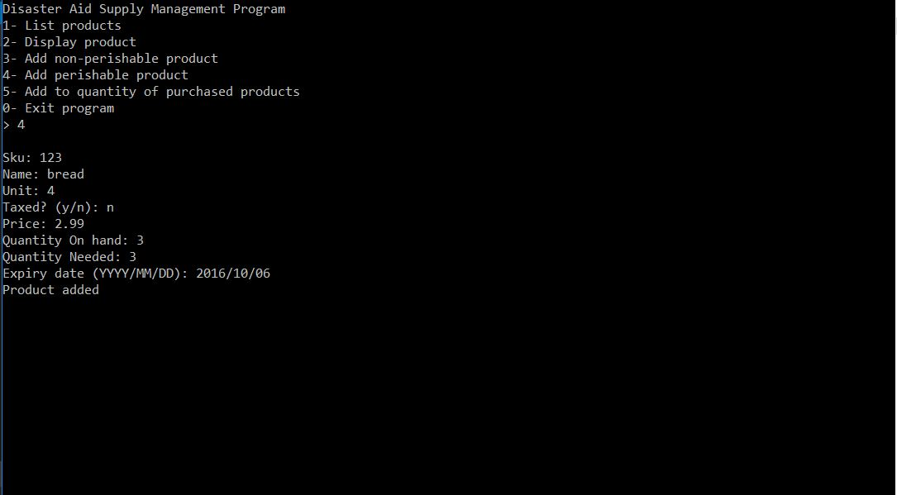
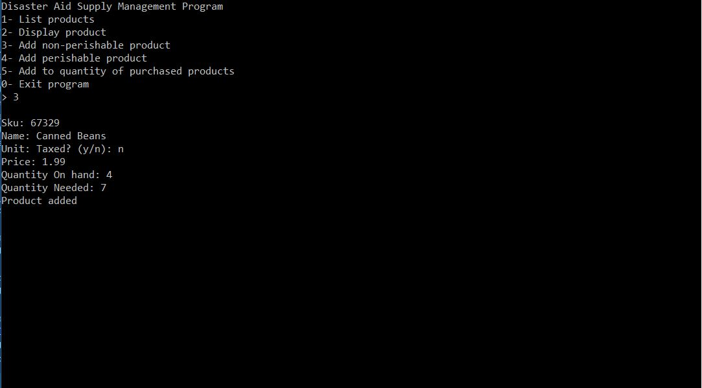

# AidApp

## Description:

A C++ application that manages a list of perishable and non perishable goods to help disaster striken areas. Keeps track of quantity, price, expiration date(if perishable) 
and tax.

This program applies object oriented programming principles and uses encapsulation, polymorphism and File I/O

**Output**:

